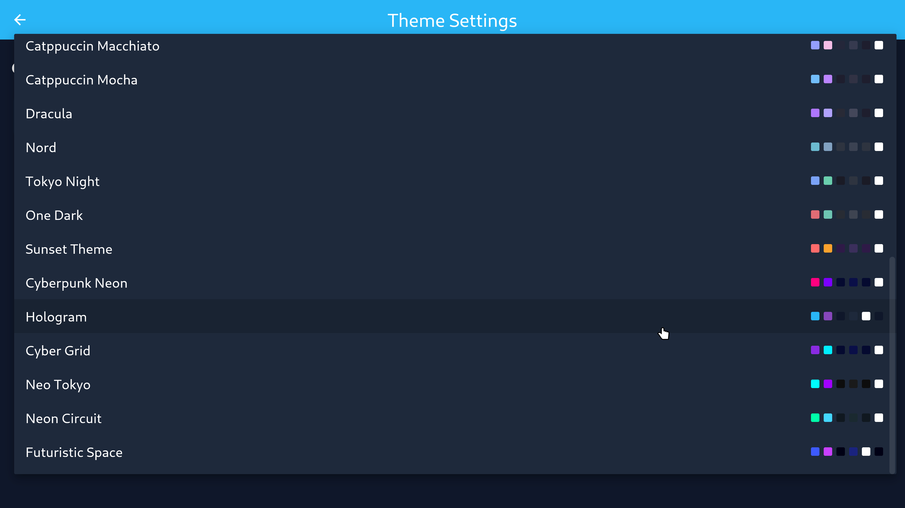
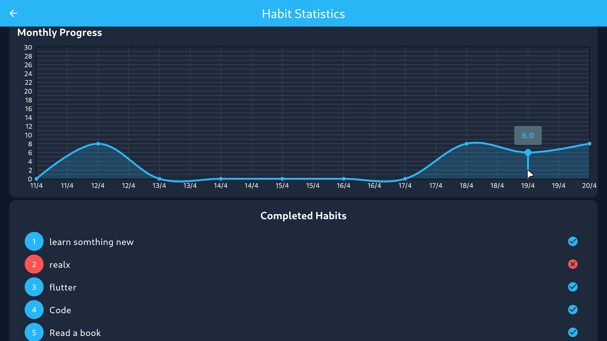
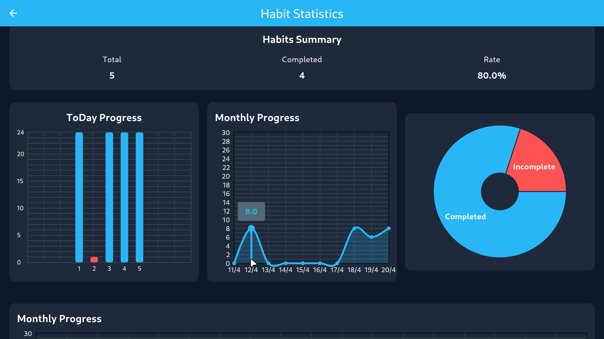

# Habit Tracker

A **beautiful**, **responsive**, and **intuitive** habit tracking app built with Flutter — designed to help you build positive daily routines with ease.

---

## ✨ Highlights

- 📝 **Create & manage daily habits** with a smooth user experience  
- ✅ **Track your progress** with simple checkmarks and visual feedback  
- 📊 **View rich statistics** with animated and interactive charts  
- 🗕️ **Weekly & monthly summaries** to visualize your growth over time  
- 🎨 **Multiple beautiful themes** with support for dark/light modes and custom color pickers  
- 🧀 **Animated UI transitions** and smooth interactions enhance the user experience  
- 💾 **Local storage** powered by Hive for persistent, offline access  
- 📱 **Fully responsive design** — works beautifully on phones, tablets, desktops, and web  

---

## 📸 Screenshots

**Home Page**  


**Theme Selection**  


**Rate Page**  
  


---

## 🚀 Getting Started

### 1. Install Flutter  
Follow the [Flutter installation guide](https://docs.flutter.dev/get-started/install).

### 2. Clone the Repository
```bash
git clone https://github.com/abod8639/habit_tracker.git
cd habit_tracker
```

### 3. Install Dependencies
```bash
flutter pub get
```

### 4. Run the App
```bash
flutter run
```

---

## 🛠️ Tech Stack

### Core
- **Flutter** 3.x
- **Dart SDK** ^3.7.0
- **Hive** for fast local storage
- **Supabase** for backend (auth & sync)
- **GetX** for state management & routing

### Key Packages
- [`fl_chart`](https://pub.dev/packages/fl_chart) — Responsive and animated charts  
- [`flutter_heatmap_calendar`](https://pub.dev/packages/flutter_heatmap_calendar) — Visual heatmap for habits  
- [`flutter_slidable`](https://pub.dev/packages/flutter_slidable) — Swipe-to-delete/edit functionality  
- [`catppuccin_flutter`](https://pub.dev/packages/catppuccin_flutter) — Beautiful theme presets  
- `flutter_colorpicker`, `flutter_secure_storage`, `hive_flutter`, and more

---

## 🛆 Dev Tools
- `build_runner` & `hive_generator` — Code generation
- `flutter_lints` — Linting for clean, maintainable code

---

## 🤝 Contributing

Pull requests are welcome!

1. Fork the repo  
2. Create your feature branch (`git checkout -b feature/YourFeature`)  
3. Commit your changes (`git commit -m "Add your feature"`)  
4. Push (`git push origin feature/YourFeature`)  
5. Open a Pull Request  

---

## 📄 License

This project is licensed under the MIT License – see `LICENSE` for details.

---

## 🙌 Acknowledgments

- Thanks to the Flutter team for this powerful toolkit  
- Special thanks to everyone who contributes and supports the project

